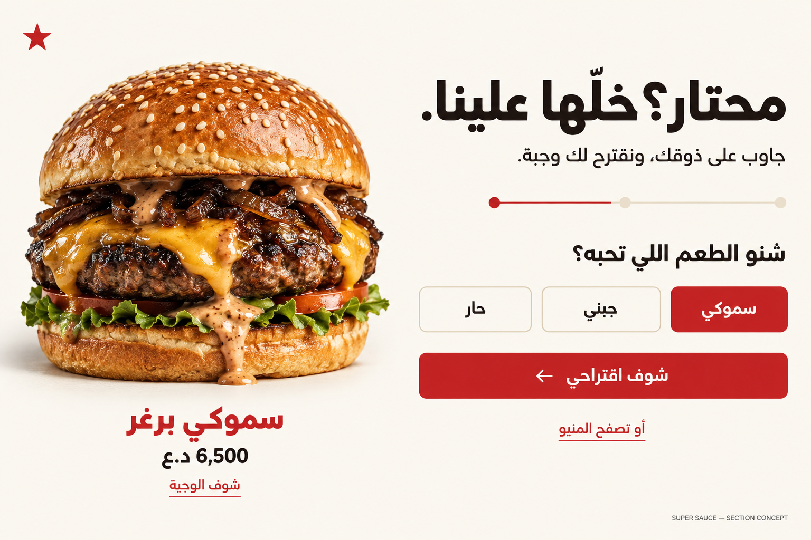
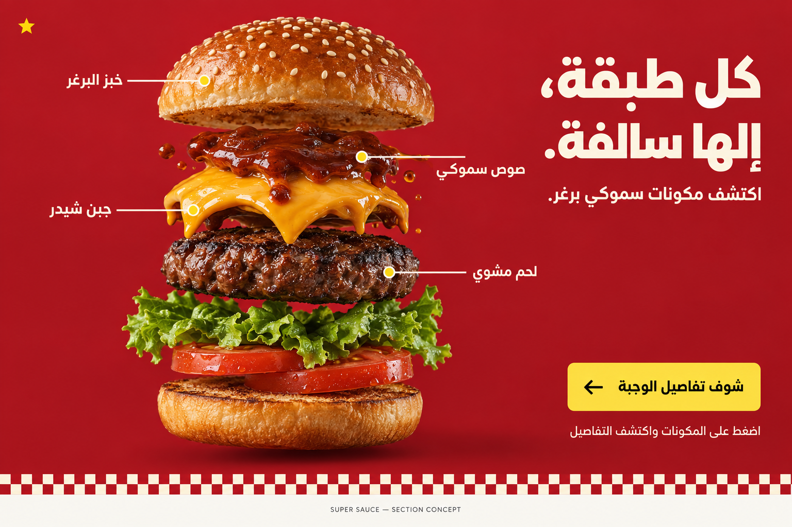
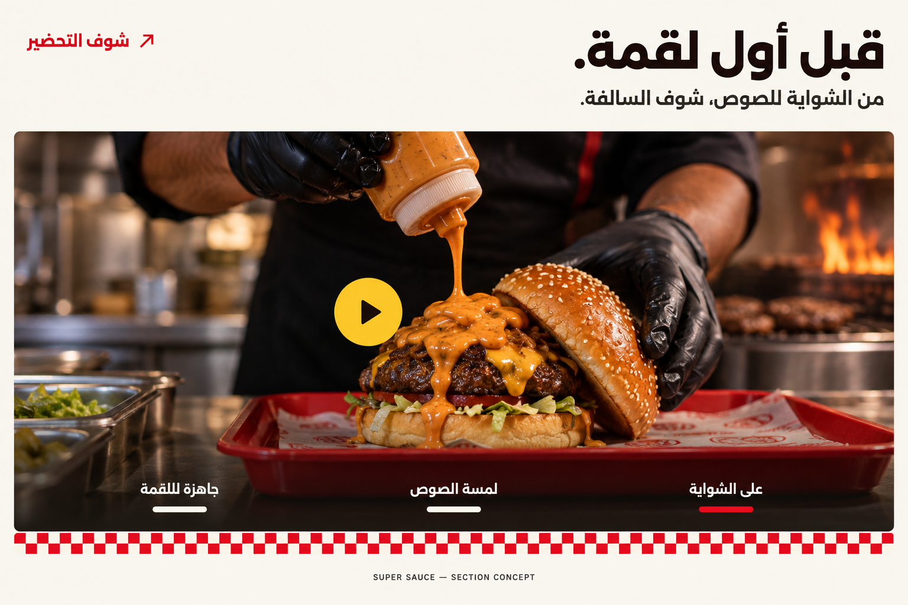

# Homepage section concepts

Generated with the built-in ImageGen tool. These are proposal mockups, not screenshots of implemented sections.

## Meal finder — محتار؟ خلّها علينا.

A short taste quiz suggests an existing menu item. Recommended first because it helps undecided visitors choose. Place immediately after the homepage menu preview.

## Ingredient story — كل طبقة، إلها سالفة.

An exploded burger with ingredient hotspots. A strong visual section that could animate as visitors scroll. Use restaurant-approved ingredients when implementing it.

## Kitchen story — قبل أول لقمة.

A cinematic behind-the-scenes video section showing grilling, sauce and assembly. Place before the branch section. A real launch should use footage from the restaurant; the generated photograph here illustrates the layout.

All exact generation prompts are in [prompts.json](prompts.json). No homepage code was changed for this concept set.
