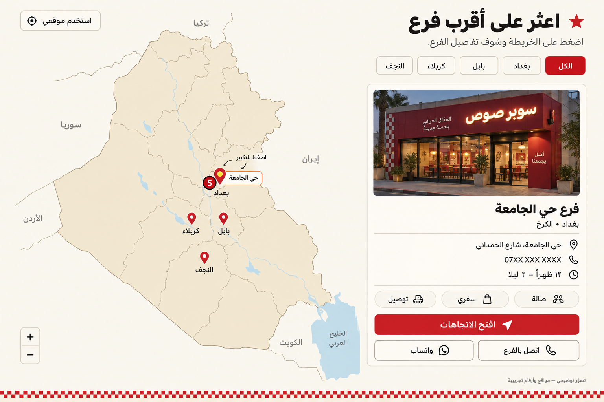
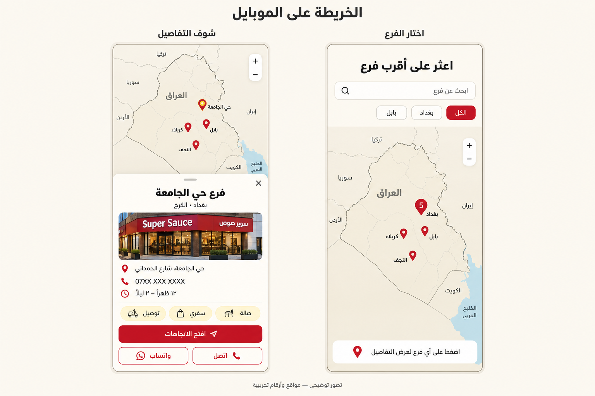
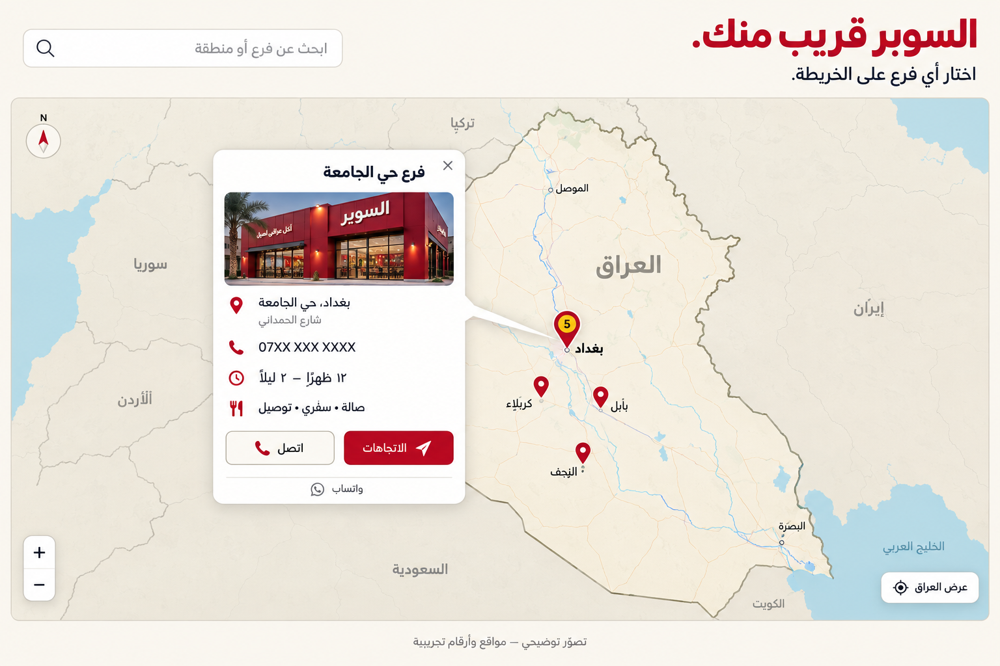

# Iraq branch map concepts

Generated with built-in ImageGen. These are visual UI proposals, not functioning maps or verified geographic datasets. The current project contains eight illustrative branch entries, no coordinates and no branch phone numbers. The mockups use sample locations and placeholder numbers.

## Desktop — map with fixed details panel (recommended)

Selecting a pin updates the adjacent branch photo, name, address, phone, hours and services. Directions, phone and WhatsApp actions stay easy to find. Cluster nearby pins at national scale and expand them as the user zooms in.

## Mobile — map with bottom sheet (recommended responsive treatment)

The right screen shows browsing and the left screen shows a selected branch. A tap opens details in a dismissible sheet with large contact buttons and the map visible above.

## Desktop alternative — popup attached to the pin

The selected branch opens in a floating popup on the map. It uses more of the section for the map but can obscure nearby pins; the fixed panel is the stronger default for the homepage.

## Intended behavior

- City filters and search narrow the branch pins.
- A cluster zooms into nearby branches; a single branch pin opens that branch's details.
- Directions opens the branch's approved map location; phone opens a call link; WhatsApp opens its approved contact.
- A list view should provide the same branch details for keyboard users and as a map fallback.
- “Use my location” is optional and requests permission only after clicking; manual search remains available.
- Use verified geographic data when implementing the map, not the generated raster as a navigable map.
- The all-branch version needs the restaurant's complete list of branches with exact coordinates or approved map links, phone/WhatsApp numbers, addresses, hours and services.

The new section would replace the current static homepage branch teaser. No application code was changed for these examples.

The exact prompt set is saved in [prompts.json](prompts.json).
